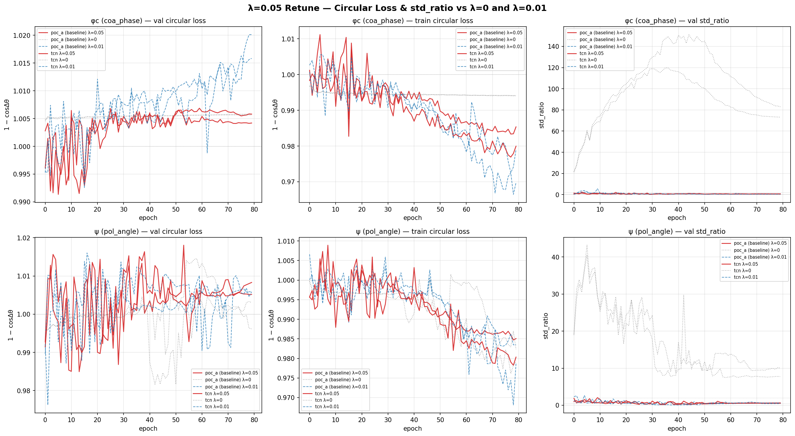

# λ=0.05 Retune — std_ratio Stabilisation

**Question**: Does raising the magnitude penalty from 0.01 to 0.05 stabilise std_ratio for tcn coa_phase and poc_a polarization_angle into the healthy 0.5-2.0 band?

| Model | Head | start | end | Δ (λ=0.05) | Δ (λ=0.01) | frac late epochs unhealthy | late trend/ep | Verdict |
|-------|------|-------|-----|-----------|------------|----------------------|----------------|--------|
| poc_a (baseline) | coa_phase | 0.4237 | 0.6558 | +0.2321 | +0.3136 | 0.07 | -0.00228 | HEALTHY |
| tcn | coa_phase | 1.3954 | 0.5924 | -0.8030 | -0.2467 | 0.05 | -0.00638 | IMPROVED, not fully stable |
| poc_a (baseline) | polarization_angle | 1.0041 | 0.5570 | -0.4470 | -1.8620 | 0.35 | +0.00718 | IMPROVED, not fully stable |
| tcn | polarization_angle | 1.8612 | 0.6216 | -1.2396 | -0.7301 | 0.17 | -0.00092 | IMPROVED, not fully stable |

### Interpretation

- **HEALTHY**: <10% of the last 40 epochs outside [0.5, 2.0] and late-epoch trend within ±0.005/ep — treat this head/model as clean for the degeneracy verdict.
- **IMPROVED, not fully stable**: fewer unhealthy epochs than λ=0.01 but not yet clean — consider λ=0.10 (see run_lam010_retune.py).
- **STILL UNHEALTHY**: raising λ to 0.05 did not fix it — check diagnostic_lam005_retune.py's prediction-perturbation trace before concluding this architecture/head combination can't be evidence either way.
