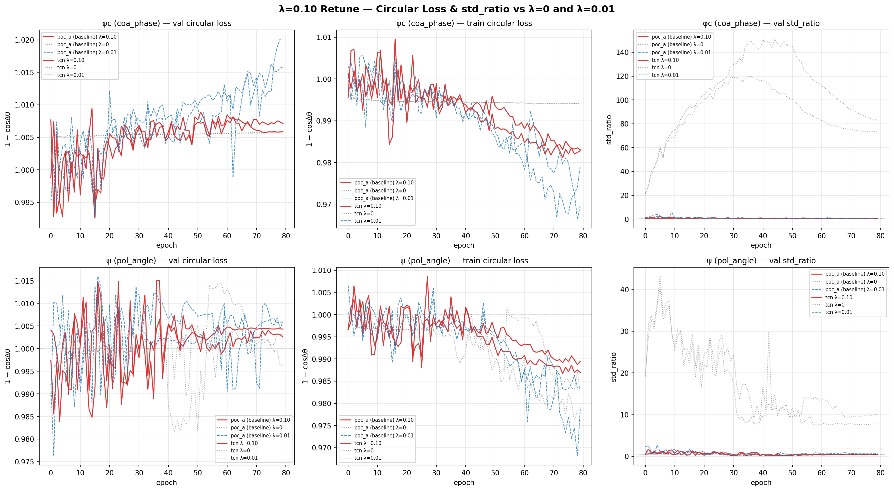

# λ=0.10 Retune — std_ratio Stabilisation

**Question**: Does raising the magnitude penalty from 0.01 to 0.10 stabilise std_ratio for tcn coa_phase and poc_a polarization_angle into the healthy 0.5-2.0 band?

| Model | Head | start | end | Δ (λ=0.10) | Δ (λ=0.01) | frac late epochs unhealthy | late trend/ep | Verdict |
|-------|------|-------|-----|-----------|------------|----------------------|----------------|--------|
| poc_a (baseline) | coa_phase | 1.3691 | 0.4925 | -0.8766 | +0.3136 | 0.60 | -0.00508 | STILL UNHEALTHY |
| tcn | coa_phase | 0.8598 | 0.6140 | -0.2459 | -0.2467 | 0.28 | -0.00255 | IMPROVED, not fully stable |
| poc_a (baseline) | polarization_angle | 0.5301 | 0.5130 | -0.0171 | -1.8620 | 0.72 | +0.00731 | STILL UNHEALTHY |
| tcn | polarization_angle | 0.5219 | 0.4952 | -0.0267 | -0.7301 | 0.90 | +0.00441 | STILL UNHEALTHY |

### Interpretation

- **HEALTHY**: <10% of the last 40 epochs outside [0.5, 2.0] and late-epoch trend within ±0.005/ep — treat this head/model as clean for the degeneracy verdict.
- **IMPROVED, not fully stable**: fewer unhealthy epochs than λ=0.05 but not yet clean — λ alone may not be sufficient for this architecture/head; consider architecture-level fixes.
- **STILL UNHEALTHY**: raising λ to 0.10 did not fix it — check diagnostic_lam010_retune.py's prediction-perturbation trace before concluding this architecture/head combination can't be evidence either way.
